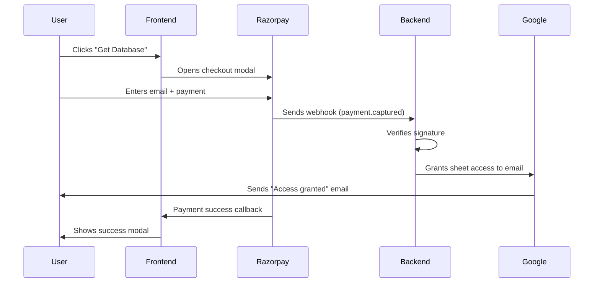

# Frontend-Backend Integration Summary

## ✅ What Was Integrated

### Frontend Changes (`index.html`)

1. **Razorpay SDK Integration**
   - Added Razorpay checkout library
   - Configured payment options with email collection
   - Implemented success/failure handlers

2. **Payment Configuration**
   - Tier 1: ₹1,100 (110000 paise)
   - Tier 2: ₹1,999 (199900 paise)
   - Matches backend pricing exactly

3. **User Experience**
   - Razorpay modal opens on button click
   - Email field is mandatory (required for access)
   - Success modal shows after payment
   - Instructions to check email for Google access

4. **CSS Improvements**
   - Fixed `background-clip` compatibility
   - Added animations for success modal

---

## 🔄 How It Works Together



---

## 📝 Configuration Required

### Frontend (`index.html` line 652)

```javascript
const RAZORPAY_KEY_ID = 'rzp_test_YOUR_KEY_ID';  // ⚠️ UPDATE THIS
```

**Get from**: Razorpay Dashboard → Settings → API Keys

### Backend (`.env`)

```env
RAZORPAY_WEBHOOK_SECRET=whsec_xxx  # From Razorpay webhook
TIER_1_PRICE=110000                # Must match frontend
TIER_2_PRICE=199900                # Must match frontend
INDIAN_SHEET_ID=xxx                # Your Google Sheet ID
YC_SHEET_ID=xxx                    # Your Google Sheet ID
```

### Razorpay Dashboard

1. **Create Webhook**:
   - URL: `https://your-backend.com/razorpay/webhook`
   - Event: `payment.captured`
   - Copy webhook secret to backend `.env`

2. **Get API Keys**:
   - Copy Key ID to frontend `index.html`
   - Keep Key Secret secure (never in frontend)

---

## 🧪 Testing Flow

### 1. Local Frontend Test

```bash
cd /Users/pratham/Desktop/outreach
open index.html
```

- Click "Get Database" button
- Razorpay modal should open
- Email field should be editable

### 2. Test Payment (Razorpay Test Mode)

**Test Card Details:**
- Card: `4111 1111 1111 1111`
- CVV: `123`
- Expiry: Any future date
- Email: Your real email

**Expected:**
1. Payment succeeds
2. Success modal appears
3. Backend receives webhook
4. Google grants access
5. Email arrives with access link

### 3. Verify Access

1. Check email for "You've been granted access" from Google
2. Click link in email
3. Sheet should open (only when logged into payment email)
4. Downloads should be disabled

---

## 🚀 Deployment Checklist

### Frontend Deployment

- [ ] Update `RAZORPAY_KEY_ID` in `index.html`
- [ ] Deploy to Vercel/Netlify/GitHub Pages
- [ ] Get public URL (e.g., `https://outreachkit.vercel.app`)
- [ ] Test payment flow on deployed site

### Backend Deployment

- [ ] Deploy backend to Railway/Render/Fly.io
- [ ] Set all environment variables
- [ ] Upload service account credentials
- [ ] Get public URL (e.g., `https://backend.railway.app`)

### Razorpay Configuration

- [ ] Create webhook pointing to backend URL
- [ ] Copy webhook secret to backend `.env`
- [ ] Test webhook delivery in Razorpay dashboard
- [ ] Switch to Live Mode when ready

### Google Setup

- [ ] Create service account
- [ ] Share sheets with service account email
- [ ] Disable downloads/copying on sheets
- [ ] Add sheet IDs to backend `.env`

---

## 📊 Payment Flow Details

### What Frontend Does

```javascript
// User clicks button
handlePurchase('tier1')
  ↓
// Opens Razorpay checkout
Razorpay.open({
  amount: 110000,
  email: required
})
  ↓
// User completes payment
  ↓
// Shows success modal
showSuccessMessage()
```

### What Backend Does

```
Webhook received
  ↓
Verify signature ✓
  ↓
Extract email + amount
  ↓
Determine tier (₹1,100 = Tier 1)
  ↓
Grant Google Sheets access
  ↓
Save to database
  ↓
Return 200 OK
```

### What User Sees

1. **Frontend**: Success modal with instructions
2. **Email**: Google's "You've been granted access" email
3. **Sheets**: Can open sheet when logged into payment email

---

## 🔐 Security Features

### Frontend
- ✅ Only uses public Razorpay Key ID
- ✅ No sensitive data stored
- ✅ Email collected by Razorpay (secure)

### Backend
- ✅ Webhook signature verification
- ✅ HMAC SHA256 constant-time comparison
- ✅ Environment variable secrets
- ✅ Service account credentials protected

### Google Sheets
- ✅ Email-based access only
- ✅ No public links
- ✅ Downloads disabled
- ✅ Copying disabled
- ✅ Revocable access

---

## 🐛 Troubleshooting

### Payment modal doesn't open

**Cause**: Razorpay Key ID not set or incorrect

**Fix**:
```javascript
// Check line 652 in index.html
const RAZORPAY_KEY_ID = 'rzp_test_abc123';  // Must be valid
```

### Payment succeeds but no access

**Cause**: Backend webhook not configured or failing

**Fix**:
1. Check Razorpay webhook URL is correct
2. Check backend logs for errors
3. Verify webhook secret matches

### Email not collected

**Cause**: Razorpay checkout not requiring email

**Fix**:
```javascript
// Ensure these settings in index.html
prefill: { email: '' },      // Empty = user must enter
readonly: { email: false }   // Allow editing
```

### Wrong amount charged

**Cause**: Frontend/backend pricing mismatch

**Fix**:
```javascript
// Frontend (index.html)
tier1: { amount: 110000 }

// Backend (.env)
TIER_1_PRICE=110000

// Must match exactly!
```

---

## 📚 Documentation

- **Frontend Setup**: [docs/FRONTEND_SETUP.md](file:///Users/pratham/Desktop/outreach/docs/FRONTEND_SETUP.md)
- **Backend Setup**: [backend/README.md](file:///Users/pratham/Desktop/outreach/backend/README.md)
- **Google Setup**: [docs/GOOGLE_SETUP.md](file:///Users/pratham/Desktop/outreach/docs/GOOGLE_SETUP.md)
- **Razorpay Setup**: [docs/RAZORPAY_SETUP.md](file:///Users/pratham/Desktop/outreach/docs/RAZORPAY_SETUP.md)
- **Deployment**: [docs/DEPLOYMENT.md](file:///Users/pratham/Desktop/outreach/docs/DEPLOYMENT.md)

---

## ✨ Key Features

### What Users Get

1. **Instant Payment**: Razorpay checkout (cards, UPI, wallets)
2. **Automatic Access**: No manual intervention needed
3. **Email Notification**: Google's native access email
4. **Secure Access**: Only works with payment email
5. **No Downloads**: View-only access

### What You Get

1. **Automated System**: No manual access grants
2. **Audit Trail**: All payments logged
3. **Revocable**: Can revoke access anytime
4. **Scalable**: Handles unlimited payments
5. **Cost-Effective**: ₹0-₹500/month hosting

---

## 🎯 Next Steps

1. **Update Razorpay Key ID** in `index.html`
2. **Deploy frontend** to Vercel
3. **Deploy backend** to Railway
4. **Configure Razorpay webhook**
5. **Test end-to-end** with test payment
6. **Switch to Live Mode**
7. **Monitor first payments**

Your system is ready to go live! 🚀
